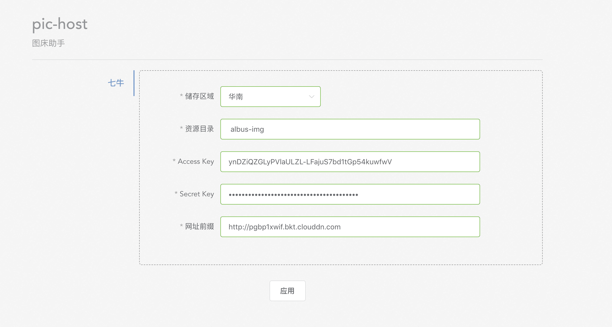

# PicHost

> 图床助手，帮助上传图片到七牛，提供多种格式链接复制功能

## 使用说明 

```
克隆代码到本地

chrome浏览器中输入chrome://extensions

将output中的crx文件拖入页面进行安装即可
```

## 配置说明


```
储存区域：使用空间储存区域
资源目录：储存空间名称
Access Key/Secret Key： 七牛个人面板-》秘钥管理
网址前缀：储存空间绑定域名
```

ps: 插件数据存在本地，token也在本地生成,不会发送任何个人数据至第三方服务器，请放心使用。

## 功能说明

支持上传方式：图片选择/图片粘贴

链接格式支持：图片url/Markdown

